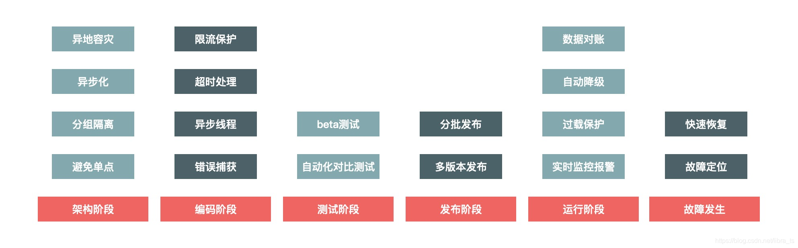

# spring

1. springboot 启动流程  
   Springboot的启动，主要创建了配置环境(environment)、事件监听(listeners)、应用上下文(applicationContext)，并基于以上条件，在容器中开始实例化我们需要的Bean
2. spring事务实现机制  
   spring事务有两种方式：显示手动提交方式和隐式自动提交。手动提交自然不用说了，就是人为控制事务。隐式自动提交采用的是aop切面动态代理实现的。我个人理解就是把手动提交那几个代码以切面方式进行实现了。
3. 对spring-alibaba了解吗？都了解哪些组件

4. springboot controller是单例的嘛，为什么要关注单例？

# redis

1. redis 基本数据类型  
   Redis支持五种数据类型：string（字符串），hash（哈希），list（列表），set（集合）及zset(sorted set：有序集合)。
2. redis是单线程还是多线程  
   redis4.0已经有了多线程的概念，但是默认是关闭的。并且redis多线程跟membercache是不同的，redis作者也强调，redis的单线程的处理能力很强，没有必要使用多线程。之所以加入了多线程是为了用来处理删除等速度较慢的指令。 redis之所以速度很快是因为底层使用的是IO多路复用，也就是reactor模型。这种模型跟java nio，linux epoll/poll的IO思路是一样的。select+轮循。同一个线程可以响应多个IO事件，异步非阻塞。多路指的是多个网络请求，复用指的就是同一个线程。 而且redis是内存式的，并且数据结构简单，也是它速度快的原因。

# 并发

1. 多个sync嵌套是程序怎么进行区分

2. 同步标记跟lock之间的区别
   <table>
   <thead>
   <tr>
   <td width=100></td>
   <td>sync</td>
   <td>lock</td>
   </tr>
   </thead>
   <tbody>
   <tr>
   <td>存在层次</td>
   <td>java关键字，jvm层面</td> 
   <td>是一个接口</td>
   </tr>
   <tr>
   <td>锁的释放</td>
   <td>程序执行完释放锁;发生异常jvm释放锁</td>
   <td>在finally中必须释放锁，否则容易造成死锁的情况</td>
   </tr>
   <tr>
   <td>锁的获取</td>
   <td>A获取，B等待。A阻塞，B一直等待</td>
   <td>有多种获取锁的方式，尝试获取锁，有公平和不公平，有共享和独享。不同的锁实现AQS的方式不同</td>
   </tr>
   <td>锁状态</td>
   <td>无法判定</td>
   <td>可以判定</td>
   <tr>
   <td>锁类型</td>
   <td>可重入，不响应中断，非公平锁</td>
   <td>可冲入，可判断，公平/非公平（二者皆可）</td>
   </tr>
   <tr>
   <td>性能</td>
   <td>少量同步</td>
   <td>大量同步</td>
   </tr>
   </tbody>
   </table>

# 分布式

1. 简单描述cap
    + Consistency: Every read receives the most recent write or an error  
      一致性：每次读取都会收到最新的写入或错误
    + Availability: Every request receives a (non-error) response, without the guarantee that it contains the most recent write  
      可用性：每个请求都会收到一个（非错误）响应，但不能保证它包含最新的写入
    + Partition tolerance: The system continues to operate despite an arbitrary number of messages being dropped (or delayed) by the network between nodes  
      分区容错：尽管节点之间的网络丢弃（或延迟）了任意数量的消息，但系统仍继续运行

# 系统设计

1. 让你设计一个抢购系统你怎么进行设计
    + 设计重点是：高性能、一致性、高可用。
    + 设计原则：数据少，请求少，路径段、依赖少、不使用单点。
    + 技术要点：
        + 动静分离 URL唯一化、分离浏览者相关的因素（包括是否已登录、登录权限等）、分离时间因素、异步化地域因素、去掉cookie。
            + 使用缓存可以处理静态数据。动态数据处理通常由两种解决方案：ESI(Edge Side Include)方案和CSI(Client Side Include)方案。
                1. ESI方案：在web代理服务器上做动态内容请求，并将请求插入到静态页面内，当用户拿到页面的时候是一个完整的页面了。这中对服务器性能有影响，但是用户体验比较好。
                2. CSI方案：单独发起js请求，向服务器端进行资源请求。这种服务器性能更优，但是用户端请求可能会演示，体验稍差。
            + 动静分离架构方案：
                1. 实体机单机部署：
                    + 优点：没有网络瓶颈，大内存；提升命中率，减少Gzip压缩
                    + 缺点：CPU浪费，单个java进程很难打满CPU
                2. 统一Cache层：
                    + 优点：可以共享内存，最大化利用内存，不同系统间的内存可以动态切换，有效防御各种攻击
                    + 缺点：Cache层内部网络交换成为瓶颈；缓存服务器的网卡也是瓶颈；机器少风险较大，挂一台机器会影响很大一部分数据。
                    + 解决缺点的方法：对Cache做Hash分组，可以有效进行数据分散不会集中在一个节点上。
                3. CND：
                    + 优点：由运营商提供服务，自动提供由距离客户最近的服务器提供访问静态相关资源
                    + 缺点：靠近访问量比较集中的地区；距离主站较远；需要节点到主站间的网络稳定相对较好；节点容量大，不影响其他CDN太多资源。节点不要太多。
                    + CND部署的特点：
                        1. 整个页面缓存在客户端
                        2. 强制刷新页面，请求CDN
                        3. 实际有效请求只有用户对“抢购”按钮的点击

                        + 这样就可以实际有效的将大部分的静态数据缓存在客户端或者CDN那里，真正秒杀的时候只有局部的“抢购”按钮需要刷新。
        + 热点数据： 2/8原则，20%的数据占据80%的流量，这部分数据就是热点数据。
            + 热点：分为热点操作和热点数据。
            + 热点数据：分为静态热点数据和动态热点数据
                1. 静态热点数据：能够提前预测的热点数据。可以通过大数据分析出热点商品数据，比如通过成交记录，购物车记录等。
                2. 动态热点数据: 不能提前被预知的数据，系统在运行中临时出现产生的热点。
            + 发现热点数据：
                1. 发现静态热点数据：可以通过商业手段，比如强制卖家通过报名参加的方式筛选商品或者通过大数据分析买家的数据来筛选热门商品。
                2. 发现动态热点数据：构建一个异步的系统，它可以收集交易链路上各个环节中的中间件产品的热点 Key，如 Nginx、缓存、RPC 服务框架等这些中间件（一些中间件产品本身已经有热点统计模块）。 建立一个热点上报和可以按照需求订阅的热点服务的下发规范，主要目的是通过交易链路上各个系统（包括详情、购物车、交易、优惠、库存、物流等）访问的时间差，把上游已经发现的热点透传给下游系统，提前做好保护。比如，对于大促高峰期，详情系统是最早知道的，在统一接入层上 Nginx 模块统计的热点 URL。
                   将上游系统收集的热点数据发送到热点服务台，然后下游系统（如交易系统）就会知道哪些商品会被频繁调用，然后做热点保护。
            + 处理热点数据：
                1. 优化：缓存热点数据。动静分离以后，可以长时间缓存静态数据。如果是临时热点数据，可以使用队列进行数据缓存，采购LRU的淘汰机制。
                2. 限制：可以进行商品ID哈希，然后根据哈希做分桶，这样就会有效的将热点商品的数据放在一个请求队列里，可以有效的防止高频热点数据的请求妨碍其他商品始终请求不到资源的问题。
                3. 隔离：将热点数据进行隔离，尽量不要因为热点商品影响主业务商品的运行。
                    + 业务隔离： 卖家搞促销报名，提前预知热点内容。
                    + 系统隔离： 将部署系统分组，可以分配单独的域名实现请求落到不同的集群。
                    + 数据隔离： 调用单独的缓存或者数据库
        + 流量削峰
            + 为何要削峰：可以让服务器处理变的更平稳；可以节省服务器的资源成本。
            + 思路：排队、答题、分层过滤
                1. 排队：用消息队列来缓冲瞬时流量，把同步的直接调用换成异步的间接推送
                2. 答题：一个是为了有效防止一些外挂程序等方式的作弊；另一个是延缓请求。
                3. 分层过滤：就是将无用请求过滤，只保留最后的有效请求再处理。
    + 影响性能的因素，如何提高性能：
        + 性能： 真正对性能有影响的就是CPU执行时间。其次就是线程对QPS的影响
        + 如何发现瓶颈： 当QPS到达极限的时候，你的服务器CPU使用率是否达到95%，如果没有达到则说明你的程序还有提升的空间。
        + 真实项目中遇到的小问题：
            + 场景：一个只有三台服务器的小商城。面对业务方突然的促销。服务器直接瘫痪。这时候考虑问题的顺序：
                1. 服务器集群数量不够
                2. 请求中携带的数据过大，违背“架构设计原则中数据尽量小”的原则
                3. 直接访问数据库进行数据请求，导致数据库请求链接数不够，无法响应，达不到高并发的场景。需要加入缓存，cdn等方式。
                4. 缓存服务器响应不过来，扩大缓存集群。
                5. 由于连接数导致响应问题，需要进行web容器，ng，数据库，缓存等中间件的最大连接数，jvm调优等。
    + 秒杀过程中“减库存”设计的核心逻辑：
        + 下单减库存
        + 付款减库存
        + 预扣库存 利弊后面有相关描述。
    + 如何设计兜底方案：
      
        + 架构阶段：主要考虑可扩展性和容错性，尽量避免单机部署
        + 编码阶段：编码保证代码的健壮性，例如涉及远程调用问题时，要设置合理的超时退出机制，防止被其他系统拖垮，也要对调用的返回结果集有预期，防止返回的结果超出程序处理范围，最常见的做法就是对错误异常进行捕获，对无法预料的错误要有默认处理结果。
        + 测试阶段：测试主要是保证测试用例的覆盖度，保证最坏情况发生时，我们也有相应的处理流程。
        + 发布阶段：发布时也有一些地方需要注意，因为发布时最容易出现错误，因此要有紧急的回滚机制。
        + 运行阶段：运行时是系统的常态，系统大部分时间都会处于运行态，运行态最重要的是对系统的监控要准确及时，发现问题能够准确报警并且报警数据要准确详细，以便于排查问题。
        + 故障发生：故障发生时首先最重要的就是及时止损，例如由于程序问题导致商品价格错误，那就要及时下架商品或者关闭购买链接，防止造成重大资产损失。然后就是要能够及时恢复服务，并定位原因解决问题。
    + 抢购系统的业务特点：一般是库存有限，ID购买有数量限制，倒计时售卖。
    + 购买的业务流程：  
      查询商品详情->点击购买，库存校验->扣库存，创建订单->支付订单
    + 查看商品详情  
      倒计时开启售卖，时间主要是依赖于本地时间，但是会定时跟服务器进行时间同步
    + 点击购买，库存校验  
      库存校验，请求量大，需要进行快速响应。一般就是放入缓存，因为是分布式服务架构，一般使用redis。 一般会有后台系统进行抢购商品的配置，在配置完毕的时候进行缓存数据的缓存。
    + 扣库存，创建订单
        + 现象：扣库存最容易出现的问题就是【超卖】
        + 步骤：中间操作有这样两个步骤，因为有缓存保存了库存，这样就会有缓存和数据库一致性的要求。
            1. 扣缓存的库存
            2. 扣数据库的库存
        + 方案：
            + 方案一：下单减库存，当买家下单后，商品库存减去买家的数量  
              问题：下单预占库存，有恶意买家下单不付款，会导致大量买家无法正常买到商品，同样会导致商家也挣不到钱
            + 方案二：付款减库存，买家下单后，并不立即减库存，而是当成功付款以后，才减库存  
              问题：方案二解决了上述方案一出现的问题，但是超卖的问题就会随着而来，因为库存有限，所以有买家就会购买失败
        + 处理方式：
            + 一般系统会进行方案一的选择，即便有一些买家不付款，但是也会有很多买家会进行捡漏，不付款的买家会被商家踢出取消订单或者系统取消超市订单恢复库存。同时进行用户统计，存在恶意下单的客户会进行相应的记录，拉黑名单进行惩罚。
            + 分布式限流：解决的方法有很多，ng限制，业务系统有计数器法，漏斗法，令牌法。一般基于redis进行令牌限流，有很多组件，主流采用google提供的组件。
    + 支付订单
        + 异步化：当进行了有效的限流等操作以后，仍会有大量的请求进入业务系统，这时候大量的请求会对数据库造成很大的请求压力，这时候我们可以 把这种下单请求放入消息队列，将并发同步请求，改为串行异步请求。

    + 总结：
        1. 尽量进行请求拦截
        2. 保护数据库资源，使用缓存技术
        3. 同步操作转变为异步操作
        4. 针对超大流量的情况，可以采用如下方式：
            + 降级：所谓“降级”，就是当系统的容量达到一定程度时，限制或者关闭系统的某些非核心功能，从而把有限的资源保留给更核心的业务。它是一个有目的、有计划的执行过程，所以对降级我们一般需要有一套预案来配合执行。如果我们把它系统化，就可以通过预案系统和开关系统来实现降级。   
              降级方案可以这样设计：当秒杀流量达到 5w/s 时，把成交记录的获取从展示 20 条降级到只展示 5 条。“从 20 改到 5”这个操作由一个开关来实现，也就是设置一个能够从开关系统动态获取的系统参数。
            + 限流： 如果说降级是牺牲了一部分次要的功能和用户的体验效果，那么限流就是更极端的一种保护措施了。限流就是当系统容量达到瓶颈时，我们需要通过限制一部分流量来保护系统，并做到既可以人工执行开关，也支持自动化保护的措施。  
              限流无疑会影响用户的正常请求，所以必然会导致一部分用户请求失败，因此在系统处理这种异常时一定要设置超时时间，防止因被限流的请求不能 fast fail（快速失败）而拖垮系统。
            + 拒绝服务：如果限流还不能解决问题，最后一招就是直接拒绝服务了。  
              当系统负载达到一定阈值时，例如 CPU 使用率达到 90% 或者系统 load 值达到 2*CPU 核数时，系统直接拒绝所有请求，这种方式是最暴力但也最有效的系统保护方式。例如秒杀系统，我们在如下几个环节设计过载保护：  
              在最前端的 Nginx 上设置过载保护，当机器负载达到某个值时直接拒绝 HTTP 请求并返回 503 错误码，在 Java 层同样也可以设计过载保护。   
              拒绝服务可以说是一种不得已的兜底方案，用以防止最坏情况发生，防止因把服务器压跨而长时间彻底无法提供服务。像这种系统过载保护虽然在过载时无法提供服务，但是系统仍然可以运作，当负载下降时又很容易恢复，所以每个系统和每个环节都应该设置这个兜底方案，对系统做最坏情况下的保护。
              
    + 参考:  
      https://blog.csdn.net/libra_ts/article/details/85198469  
      https://zhuanlan.zhihu.com/p/73659339

# 数据库

1. 数据库中导致索引失效都有哪些情况？

2. 为什么不推荐使用外键

+ 优点：数据强一致性;ER图可靠易读。
+ 缺点：级联问题;增加数据库压力;死锁问题:高并发场景下很容易造成死锁;开发不方便
+ 总结：
    + 如果是单机并且并发不高的情况，不需要性能调优，或者不能使用程序保证数据的一致性和完整性，可以使用外键
    + 如果为了高并发，分布式，使系统性更优，更好维护，不要使用外键

# 设计模式

1. 开发商常用的设计模式都有那些？
    + 模板方法模式：经典使用就是AQS共享和非共享获取和释放锁的实现
    + 工厂方法模式：spring实例工厂的实现
    + 代理模式：最简单的应用就是代理类将所有其他模块业务方法的调用进行封装  
   